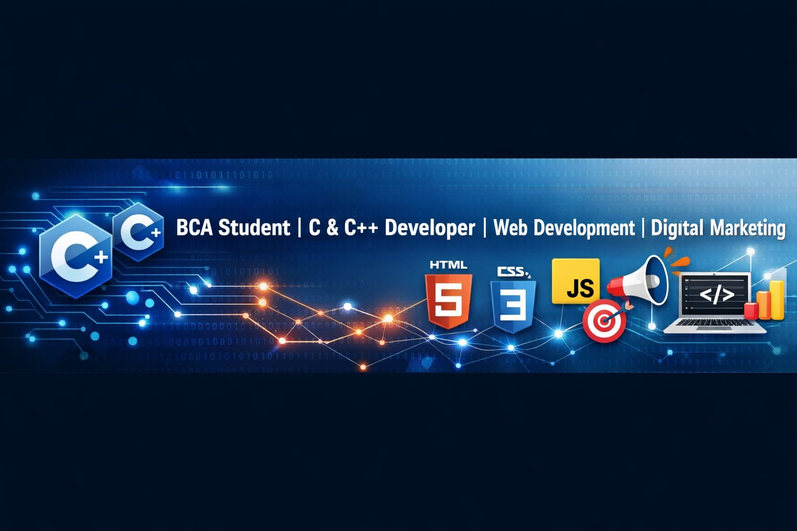

# 👋 About Me
I'm a first-year BCA student 🎓 and Digital Marketing Enthusiast 📊, passionate about programming 💻 and technology 🌐. I enjoy creating projects 🛠️ and exploring new concepts in software development 🚀.

---
# 🚀 Projects

## Programming

🌐 **C Source Point** – Website presenting C programming examples (HTML, CSS, JavaScript)  
🔗 https://kashishgupta03012007.github.io/c-source-point/

📂 **C Source File** – Practice collection of C programs  
🔗 https://github.com/kashishgupta03012007/c-source-file

🌐 **C++ Source Point** – Website introducing OOP and C++ concepts with examples (uploading soon...)

📂 **C++ Source File** – Collection of C++ programs based on Object-Oriented Programming (uploading soon...)

📂 **Calculator (C++ OOP)** – Calculator application developed using OOP principles 🧮  
🔗 https://github.com/kashishgupta03012007/c--oops-calculator

## Web Design

🌐 **Hunger Point** – Restaurant website built using HTML and CSS 🍽️ (soon...)

🌐 **Moonlight Cafe** – Cafe website designed using HTML, CSS, and JavaScript ☕ (coming soon...)

🌐 **Success Point** – Coaching institute website built with HTML, CSS, and JavaScript 🎓 (coming soon...)

---
# 🛠️ Tech Stack

💻 **Programming:**  
  

🌐 **Web Development:**  
  
  

📊 **Interest Area:** Digital Marketing

---
# 📚 Currently Learning
📌 C Programming  
📌 C++ and Object-Oriented Programming  
📌 Web Development  
📌 Digital Marketing

---
# 🎯 Goals
✨ Expand technical knowledge  
✨ Develop useful projects  
✨ Grow as a software developer
